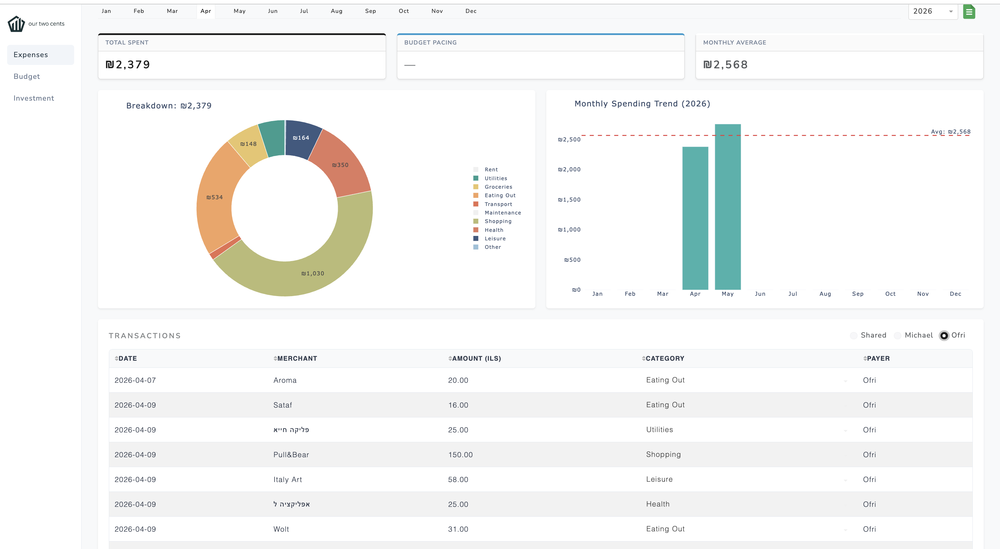
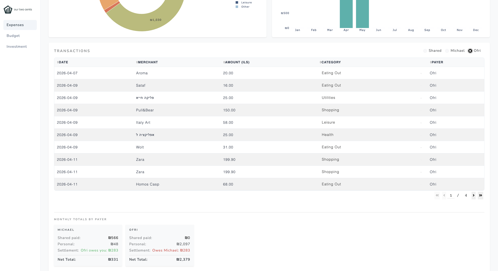
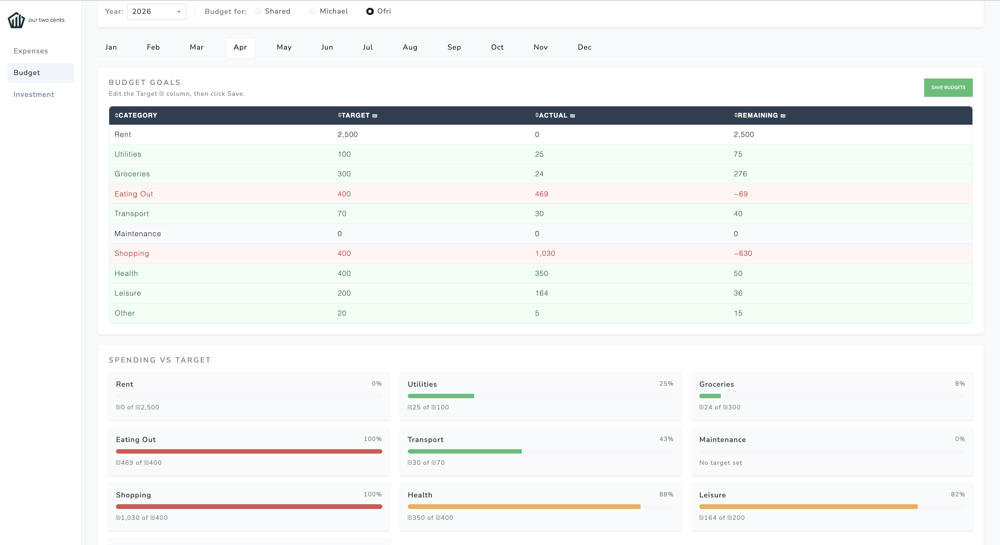
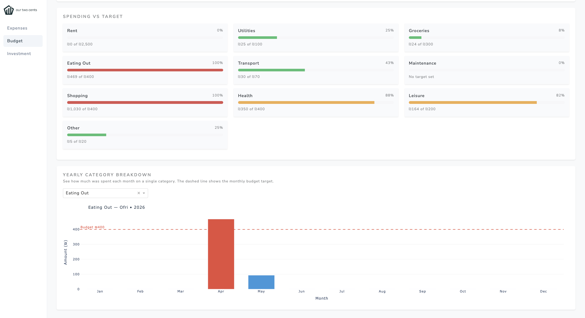
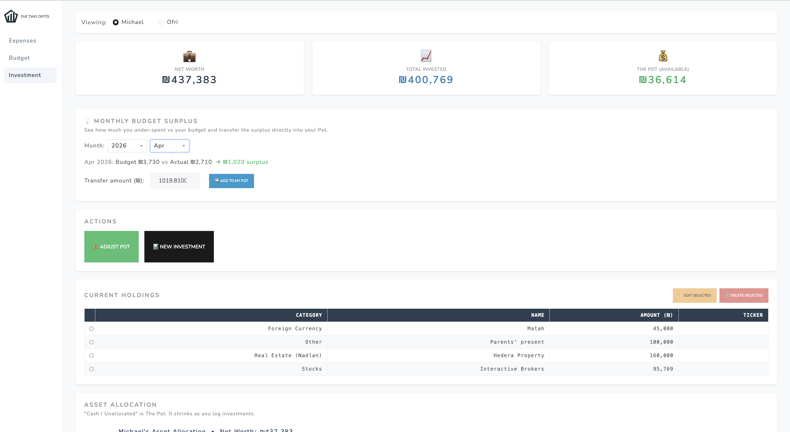
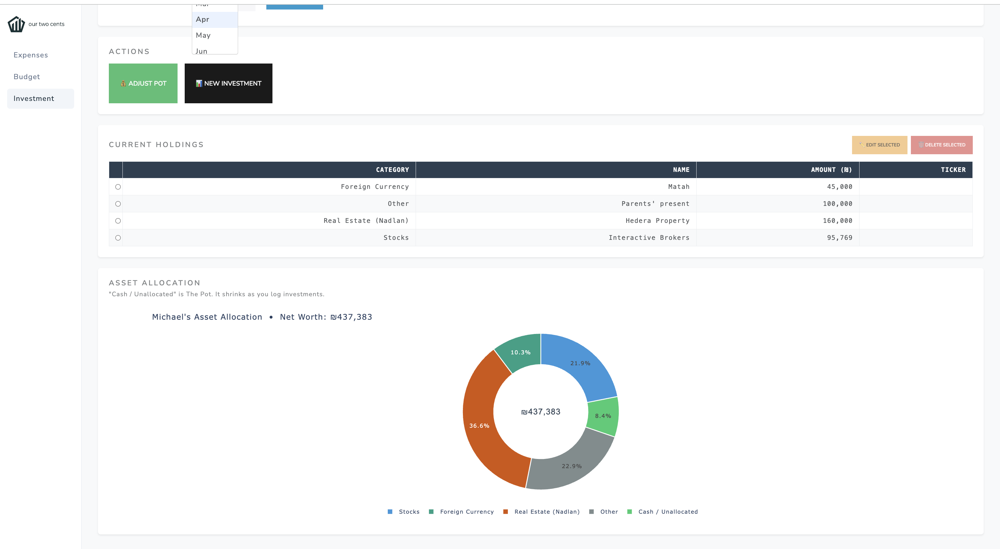

# Finance Couple Bot

> A full-stack personal finance tracker for two — powered by Telegram, GPT-4o, Gmail, and a live web dashboard.

  

## What It Does

Michael and Ofri share expenses. This system automatically captures transactions from Gmail receipts, card alerts, and manual Telegram input — parses them with GPT-4o — and displays everything on a live dashboard with charts, budget tracking, and settlement calculations.

## Features

- **Automatic Gmail parsing** — detects financial emails and PDF receipts, extracts amounts and merchants using GPT-4o (supports Hebrew text)
- **Telegram bot** — manual expense entry and real-time AI-generated spending insights every 3 days
- **Card app integration** — receives live transaction webhooks from mobile card apps
- **Interactive dashboard** — filter by month, split type, and payer; view charts, edit transactions inline
- **Budget tracking** — set monthly targets per category, track pacing in real time
- **Settlement calculator** — automatically calculates who owes whom each month
- **Google Sheets export** — export any month's transactions to a Google Sheet with one click
- **AI insights** — GPT-4o-mini analyzes spending patterns and sends alerts via Telegram

## Architecture

```
Gmail / Card App / Telegram
         ↓
  Flask API (PythonAnywhere)
         ↓
  GPT-4o — parse merchant, amount, category
         ↓
  User confirms: Shared or Personal (Telegram inline keyboard)
         ↓
  SQLite Database
         ↓
  Dash Dashboard (Render) — charts, budgets, export
         ↓
  AI Insights (every 3 days) → Telegram notification
```

## Tech Stack

| Layer | Technology |
|-------|-----------|
| Bot | pyTelegramBotAPI |
| API | Flask + SQLite |
| AI | GPT-4o, GPT-4o-mini (OpenAI) |
| Email | Gmail API + Google Pub/Sub |
| Dashboard | Dash + Plotly |
| Export | Google Sheets API + gspread |
| Deployment | PythonAnywhere (backend) + Render (frontend) |

## Design Decisions

**SQLite over Postgres** — two users, effectively one writer at a time, and zero infrastructure to operate or pay for. The cost: SQLite locks the whole file on writes, so it wouldn't survive real concurrency, and the database lives on the server's disk, meaning a stateless redeploy would wipe it.

**GPT-4o for parsing, GPT-4o-mini for insights** — a parsing error writes a wrong amount into the database and silently corrupts the monthly settlement, so accuracy is worth the higher cost there. Insights are advisory text delivered every 3 days; if they're slightly less precise, nothing breaks. The cheaper model is the right choice for that job.

**Human confirmation before saving** — the model classifies each transaction as shared or personal, and that field directly determines who owes whom. Rather than trust the classification silently, a single Telegram inline-keyboard tap lets the user confirm or correct it before anything is written to the database. This eliminates an entire category of silent financial error.

**Flask over Django** — the backend is ~10 API routes with no ORM, no admin panel, and no user auth system. Django's defaults solve problems this project doesn't have. Flask is the right size.

**PythonAnywhere (backend) + Render (frontend) split** — PythonAnywhere routes all outbound traffic through a proxy, which is required for Gmail API calls from their servers. Render hosts the Dash dashboard, which has no such constraint. The cost: two platforms to configure and keep in sync.

**GitHub Actions for scheduled tasks** — PythonAnywhere's free tier has no cron jobs. GitHub Actions provides free scheduled runs for the Gmail watch renewal (every 6 days) and AI insights delivery (every 3 days). The cost: if GitHub Actions is delayed or down, those jobs miss their window silently.

**Known limitations**
- No deduplication between the card webhook and a Gmail receipt for the same purchase — both sources can write the same transaction
- No retry if the OpenAI API call fails mid-processing; the expense is silently dropped
- Amounts stored as floats, not decimals — rounding edge cases are possible in settlement calculations
- No automated tests on the Gmail parsing path; changes there are verified manually

## Screenshots

### Expenses
| | |
|:---:|:---:|
|  |  |

### Budget Tracking
| | |
|:---:|:---:|
|  |  |

### Investments
| | |
|:---:|:---:|
|  |  |

## Setup

### Prerequisites
- Python 3.11+
- Telegram bot token (via BotFather)
- OpenAI API key
- Google Cloud project with Gmail API, Sheets API, and Pub/Sub enabled

### Backend

```bash
cd backend
pip install -r requirements.txt
```

Create a `.env` file with the following variables:

```
TELEGRAM_TOKEN=
MY_CHAT_ID=
OPENAI_API_KEY=
GOOGLE_PROJECT_ID=
SHEETS_SPREADSHEET_ID=
CRON_SECRET=
PAYER_1=YourName
PAYER_2=PartnerName
PAYER_1_EMAIL=your@gmail.com
PAYER_2_EMAIL=partner@gmail.com
```

Run locally:
```bash
python flask_app.py
```

### Frontend

```bash
cd frontend
pip install -r requirements.txt
python app.py
```

## Deploy Your Own

This project is fully configurable — anyone can run their own instance for their couple.

1. Fork this repo on GitHub
2. Set up your own PythonAnywhere (backend) and Render (frontend) accounts
3. Set your `.env` variables with your own names, emails, and API keys
4. Run `gmail_setup.py` to authorize Gmail access for both accounts
5. Upload your `service_account.json` to PythonAnywhere

